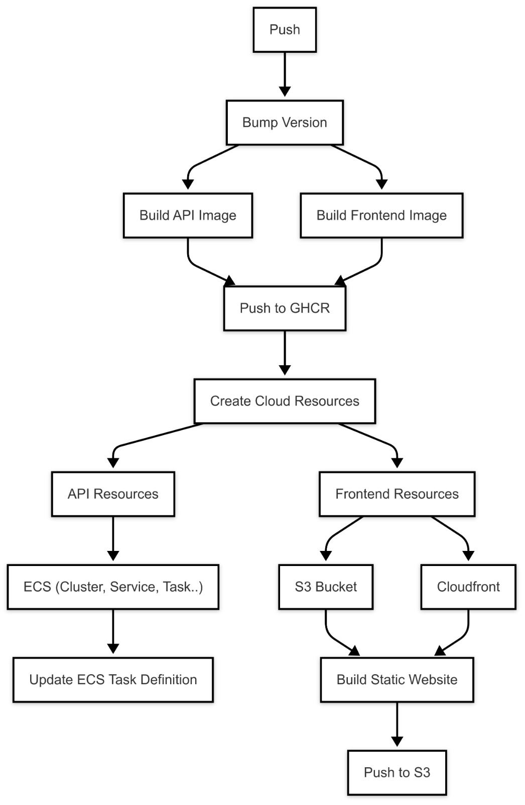

# Health Check App

## Overview

This project demonstrates a CI CD flow of a simple web app, which is deployed to **AWS** using **Terraform** & **GitHub Actions**.

* The Frontend was created using [V0](https://v0.dev//)
    * V0 was selected due to its UI generation capabilities - V0 is a tool that provides a full UI layouts that allow users to create React and Next.js web apps easily.
    * I used and modified the following [template](https://v0.dev/chat/community/floating-bubbles-1g1VZMvHP0o)
* The API was created using ChatGPT
    * ChatGpt provided a simple Node.js and Express App

## Table of Contents
* [Architecture](#Architecture)
    * [AWS Resources Deployed with Terraform](#aws-resources-deployed-with-terraform)
        * [Main Workflow Diagram](#main-workflow-diagram)
    * [Repository Structure](#repository-structure)
* [Running on AWS Cloud](#running-on-aws-cloud)
* [Running Locally - Docker Compose](#running-locally---docker-compose)

## Architecture
### AWS Resources Deployed with Terraform

The Terraform configuration provisions the following AWS resources:

- **S3 Bucket**:
    - **Terraform backend bucket** is used as the backend for Terraform state.
    - **Frontend bucket** is used to store the Frontend app files.
- **DynamoDB Table**: Implements state locking to prevent concurrent Terraform executions.
- **CloudFront**: cloudfront will be the access point to the Frontend S3
- **Amazon ECS**: The API will be containerized and deployed on a serverless Fargate
- **IAM Roles and Policies**: Define roles to make sure only the IAM user will be permitted to perform on and access the resources.
- **CloudWatch**: Enables monitoring and logging for the app.

#### Main Workflow Diagram


* The API is stored at GHCR, and deployed to ECS
* The Frontend is stored at S3 bucket and is accessible only via CloudFront

### Repository Structure

```
health-check-app/
├── .github/
│   └── workflows/
│       ├── bootstrap-terraform-backend.yml
│       ├── main-workflow.yml
│       ├── ...
├── api/
│   ├── src/
│   │   └── Dockerfile
│   └──  terraform/
├── frontend/
│   ├── src/
│   │   └── Dockerfile
│   └── terraform/
├── terraform-bootstrap/
│   └── main.tf
├── docker-compose.yaml
└── README.md
```

## Running on AWS Cloud
### Prerequisites
#### 1. Required Secrets for GitHub Actions


The project requires an **IAM account** with specific [permissions](#2-required-iam-permissions) to deploy infrastructure and manage the Terraform state. The following secrets and variables must be set in the GitHub repository settings:

**Secrets:**

| Secret Name               | Description |
|---------------------------|-------------|
| `AWS_ACCESS_KEY_ID`       | IAM access key for Terraform and CI/CD operations |
| `AWS_SECRET_ACCESS_KEY`   | IAM secret key for Terraform and CI/CD operations |


**Variables:**

| Variable Name              | Description                                     |
|----------------------------|-------------------------------------------------|
| `AWS_REGION`               | AWS region where the infrastructure is deployed |
| `FRONTEND_BUCKET`   | Used to store Frontend build files              |
| `TERRAFORM_BACKEND_BUCKET` | Used to store the terraform state files         |
| `DYNAMODB_TABLE_TF_LOCK`   | DynamoDB table name for Terraform state locking |


#### 2. Required IAM Permissions

The IAM user must have permissions to:
* Create, Read, Write and Delete S3 Buckets
* Create, Read, Write and Delete DynamoDB
* Create, Read, Write and Delete CloudFront
* Create, Read, Write and Delete ECS
* Read VPC


### Running GitHub Actions
#### 1. Bootstrap Terraform Backend(run only once!)

The first step is to run the **Bootstrap Terraform Backend** workflow, which initializes the Terraform state backend.

<small>***The backend should be created only once, because if you run it again it will fail due to duplicate resources.***</small>

#### 2. Run the Main Workflow

Once the backend is set up, execute the **Main Workflow**, which deploys infrastructure, build images and deploys it to AWS


## Running Locally - Docker Compose

This section provides the steps to set up and run the project locally using Docker Compose.

### Prerequisites

- Ensure that [Docker](https://docs.docker.com/get-docker/) is installed.

### Steps

1. **Start the Services**  
   In your terminal, navigate to the project directory and run:
   ```bash
   docker compose up

2. **Access the Application**  
   Once the containers are running, open your web browser and go to: http://localhost:3000


**This project is for demonstration only**

no warranties, no guarantees. just for demonstration purposes only!
